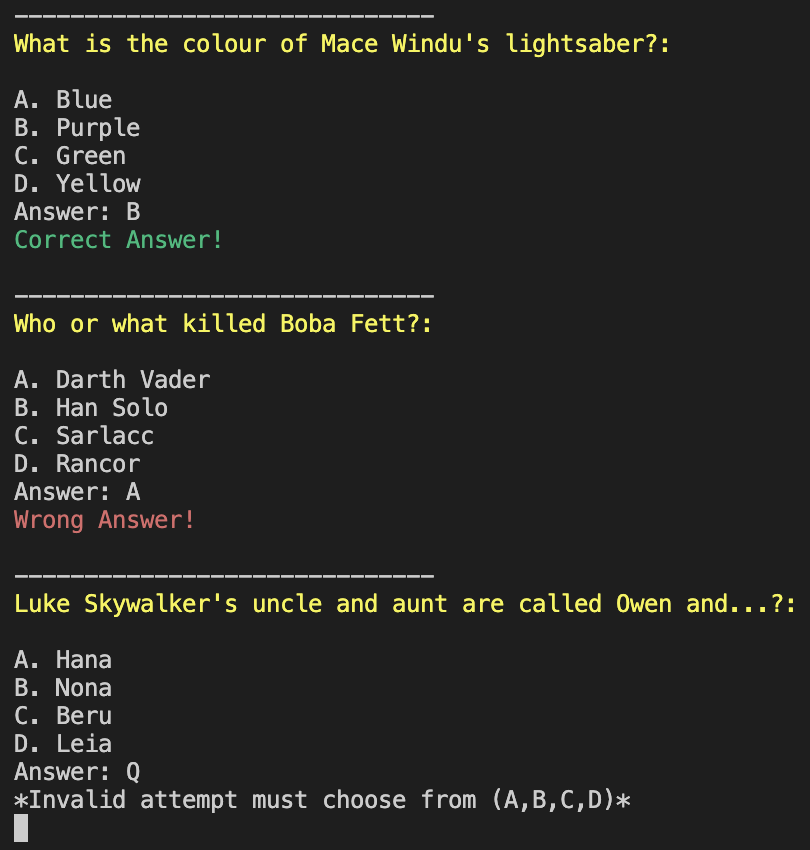

# Star Wars Quiz

Star Wars Quiz is a Python terminal game, which runs in the Code Institute mock terminal on Heroku. The terminals main purpose is for users to test their Star Wars knowledge. Anyone is eligible to take the quiz. 

## How to Play

There is 10 questions to answer with the options (A, B, C, D).

To move onto the next question you must select and option and press enter key to submit your answer and next question will generate.

Users will be given a score at the end of the quiz.

You can play again when prompted by replying yes or no.

## Features

### Intro Screen:

- This start section is used to explian the rules to the user about how to take the Quiz.

 

### Quiz Questions:

- Each question is highlighted in yellow to stand out to the user.
- To answer the question you must input (A,B,C,D).
- If you get it right a message is printed, same if you get one wrong.
- If you put in a invlaid input a message is prompted and you get to type another answer.

### Score:

- The correct answers are displayed.
- Your score is displayed after being calcutaled by each correct attempts which equals 1 point divided by the length of questions (10) and multiplied by 100 with a string at the end to make it look like a percenatge score. 

### Play Again Input:

- Here you have the option to play the quiz again but inputting yes. 
- If you answer no, a message is printed and game ends. 

### Future Features

  - I would like to double the amount of available questions and make it a random 10 questions from this. 

## Data Models

I used a dictionary to store my data for my quiz questions and a list of lists to store the corresponding answers.

## Logic

### Flowchart 

## Testing 

### Validator Testing

I have manually tested this project by doing the following:

- Python - No errors were found when passing through the official [(PEP8) linter](https://pep8ci.herokuapp.com/).

- Tested in my local terminal and the Code Institute heroku terminal. 

### Bugs

At first I didnt have the correct input validation and if you put a lowercase (a,b,c,d) it would be wrong cause my while statemnt was strict on having to sumbit capital letters. So I chnaged it by adding .lower() so my validation was completed correctly. 

# Deployment 

The live link can be found here - 

- Fork or clone this repository 
- Create a new Heroku app
- Set the buildpacks to Python and NodeJS in that order
- Link the Heroku app to the repository 
- Click on Deploy 

# Credits 

- I used this video as inspiration for my code but I expanded and added from this concept - (https://www.youtube.com/watch?v=YScd9FqGAZs)
- This site was used to give inspiration for my database and better understand the use of dictionaries in python -  (https://realpython.com/python-quiz-application/)
- Colorama was used to add some color to my quiz in the terminal - (https://pypi.org/project/colorama/)
- This was used by my mentor to explain how to change my inputs to accept both uppercase and lowercase inputs of the same value - (https://stackoverflow.com/questions/9257094/how-to-change-a-string-into-uppercase)